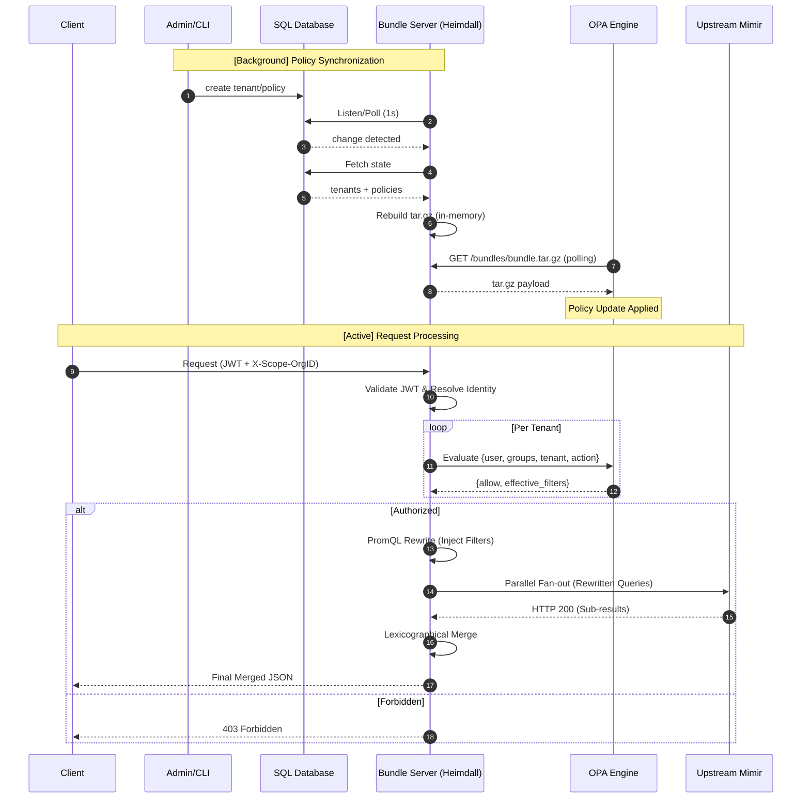

## Heimdall Architecture

**Heimdall** is an identity-aware, multi-tenant reverse proxy for **Grafana Mimir**. It enforces access control and ensures data isolation by injecting PromQL label filters into queries based on user identity.

---

## 1. Request Lifecycle & Fan-out

The system follows a non-reorderable pipeline to ensure security and deterministic results.

### Unified System Flow

Heimdall maintains policy state via background synchronization while processing active proxy requests.

### Resource Safety & Concurrency

* **Bounded Fan-out**: Parallel requests use a bounded worker pool to prevent resource exhaustion.
* **Backpressure**: If capacity is exceeded, Heimdall returns a 503 error with the code `fanout_overloaded`.
* **Context Awareness**: All outbound calls respect request context cancellation and configurable timeouts. If a client disconnects prematurely, Heimdall sheds load and explicitly responds internally with a `499 Client Closed Request` JSON envelope.

---

## 2. Policy & Data Model

Heimdall treats the policy document as the unit of access control.

### Policy Schema

Policies are stored in SQL via GORM and validated against a JSON schema before writing.

* **`effect`**: Either `allow` or `deny`. **Deny always wins**.
* **`subjects`**: An array of `type` (`user` or `group`) and `id`.
* **`actions`**: Permissions such as `read`, `write`, `rules:read`, or `*` for wildcards.
* **`scope`**: Defines the `tenants` and `resources` (e.g., `metrics`) the policy applies to.
* **`filters`**: An array of PromQL label matchers (e.g., `env="prod"`). An empty array (`[]`) grants full, unfiltered access.

### Identity Sovereignty

* **No Local Users**: User and group tables are **never** stored in SQL; identity is derived exclusively from the JWT at request time.
* **Tenant Registry**: The `tenants` table serves as the source of truth for OPA wildcard expansion.

---

## 3. Policy Enforcement Modes

The handler derives the filter mode from the action; OPA does not return it.

| Mode | Actions | Behavior |
| --- | --- | --- |
| **Request Mode** | `read` | Filters are injected into the PromQL AST before forwarding. |
| **Response Mode** | `rules:read`, `alerts:read` | Objects not matching effective filters are dropped from the response. |
| **Pass-Through** | `write`, `rules:write`, `alerts:write` | Authorization-only; body is forwarded byte-for-byte without mutation or inspection. |

---

## 4. Control Plane: OPA Bundle Server

OPA is updated via an in-process bundle server that serves a data snapshot.

* **Atomic Updates**: Rebuilds are mutex-protected and built in-memory to ensure OPA never reads a corrupted/partial bundle.
* **Update Detection**: Uses PostgreSQL `LISTEN/NOTIFY` (detecting DB-level triggers) or background polling for SQLite.

---

## 5. Operational Invariants

* **Fail-Fast Startup**: The application terminates if configuration is missing, migrations fail, or security-sensitive parameters are unset.
* **JSON Error Envelope**: Every error uses a mandatory JSON structure with machine-readable codes.
* **Mandatory Tracing**: Every request is instrumented via OpenTelemetry, with trace context propagated to all logs and outbound calls.