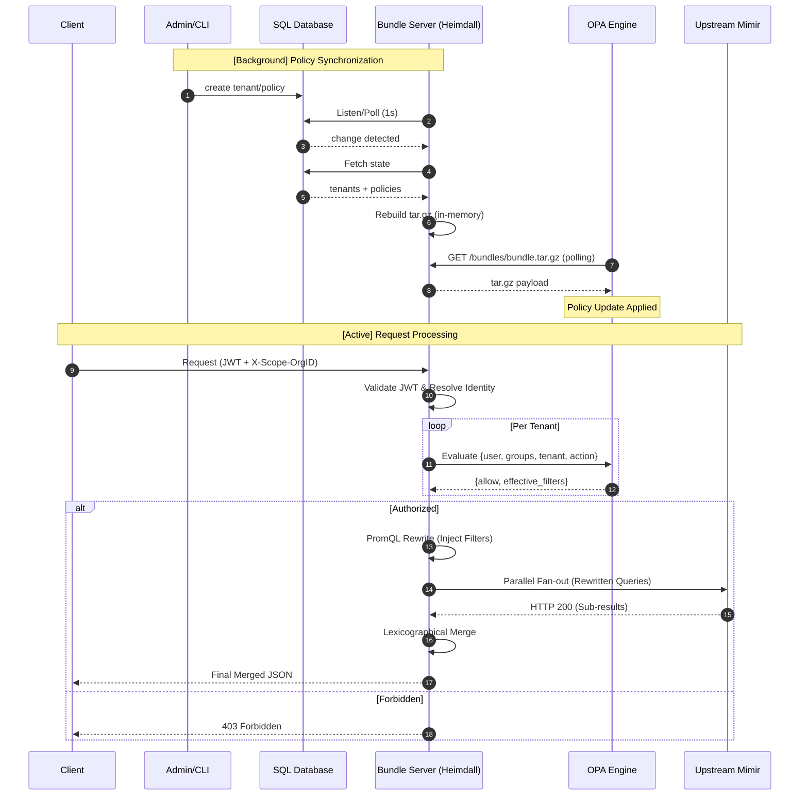

# Heimdall

 [](https://opensource.org/licenses/MIT) [](https://github.com/f46b83ee9/heimdall/actions/workflows/ci.yml) [](https://golang.org/doc/devel/release.html) [](https://goreportcard.com/report/github.com/f46b83ee9/heimdall) 

An identity-aware reverse proxy for [Grafana Mimir](https://grafana.com/oss/mimir/) that enforces multi-tenant access control using [OPA](https://www.openpolicyagent.org/) and PromQL query rewriting.

## What It Does

Heimdall sits between your users and Mimir, ensuring every request is:

1. **Authenticated** — JWT validated against your JWKS endpoint
2. **Authorized** — OPA evaluates per-tenant policies (allow/deny with filter scoping)
3. **Rewritten** — PromQL queries get label matchers injected from policy filters (e.g. `env="prod"`)
4. **Federated** — Multi-tenant queries use Mimir's native federation (`X-Scope-OrgID: acme|globex`)

### System Architecture & Request Flow

Heimdall manages policy synchronization in the background while processing active requests.



## Build

### With Go

```bash
make build
```

### With Docker

```bash
docker build -t heimdall .
```

## Run

### Prerequisites

- **Database (PostgreSQL or SQLite)** — stores tenants and policies
- **OPA** — evaluates authorization policies (pulls bundle from Heimdall)
- **JWKS endpoint** — for JWT signature verification

### Configuration

Create a `config.yaml` (see [config.example.yaml](config.example.yaml) for a fully documented version):

```yaml
server:
  main:
    addr: ":9091"              # Proxy API
  bundle:
    addr: ":9092"              # OPA bundle server
  log_level: "info"            # debug, info, warn, error

mimir:
  url: "http://mimir:8080"
  insecure_skip_verify: false  # TLS toggle
  auth:
    type: "bearer"
    token: "your-mimir-token"

jwt:
  jwks_url: "https://your-idp.com/.well-known/jwks.json"
  issuer: "https://your-idp.com/"
  audience: "heimdall"

opa:
  url: "http://opa:8181"
  insecure_skip_verify: false

database:
  driver: "sqlite"
  dsn: "heimdall.db"

fanout:
  max_concurrency: 10

telemetry:
  enabled: false
  insecure_skip_verify: false
```

All configuration can be overridden with environment variables using the `HEIMDALL_` prefix (e.g. `HEIMDALL_DATABASE_DSN`).

### Start with Go

```bash
./heimdall serve --config=config.yaml
```

### Start with Docker

```bash
docker run -v $(pwd)/config.yaml:/etc/heimdall/config.yaml \
  -p 9091:9091 -p 9092:9092 \
  heimdall serve --config=/etc/heimdall/config.yaml
```

### Configure OPA to Pull Bundles

OPA should be configured to pull its bundle from Heimdall's bundle server:

```yaml
services:
  heimdall:
    url: http://heimdall:9092

bundles:
  authz:
    service: heimdall
    resource: /bundles/bundle.tar.gz
    polling:
      min_delay_seconds: 5
      max_delay_seconds: 10
```

## Manage Tenants & Policies

```bash
# Create tenants
./heimdall tenant create acme "Acme Corp" --config=config.yaml
./heimdall tenant create globex "Globex Inc" --config=config.yaml

# Create policies from a JSON file (standard way)
./heimdall policy create policies.json --config=config.yaml

# Create policies from stdin
cat policies.json | ./heimdall policy create - --config=config.yaml
```

### Policy Example (`policies.json`)

```json
[
  {
    "name": "allow-alice-read-acme",
    "effect": "allow",
    "subjects": [{"type": "user", "id": "alice@acme.com"}],
    "actions": ["read"],
    "scope": {
      "tenants": ["acme"],
      "resources": ["metrics"]
    },
    "filters": ["env=\"prod\""]
  }
]
```

## Observability & Instrumentation

Heimdall is designed for production visibility, with native support for structured logging, distributed tracing, and Prometheus metrics.

### Structured Logging

Heimdall uses `slog` for structured, machine-readable logs.

- **Trace Correlation**: When telemetry is enabled, every log line automatically includes `trace_id` and `span_id`.
- **Log Level**: Configurable via `server.log_level` (e.g., `debug`, `info`, `warn`, `error`).

Example:
```bash
INFO request started trace_id=abc123 span_id=def456 method=GET path=/api/v1/query
DEBUG PromQL rewritten trace_id=abc123 span_id=789abc original="up" rewritten="up{env=\"prod\"}"
```

### Distributed Tracing (OpenTelemetry)

Every request generates a trace across the entire lifecycle. Heimdall exports traces via **OTLP/gRPC**.

#### Configuration

```yaml
telemetry:
  enabled: true
  service_name: "heimdall"
  otlp_endpoint: "jaeger:4317"
  insecure_skip_verify: false       # Set to true for self-signed OTLP collectors
  auth:
    type: "bearer"                  # Supports: none, basic, bearer, api_key, mtls
    token: "..."
```

#### Trace Structure (Spans)

The following spans are generated for a standard multi-tenant query:

```text
Method Path                   # Root span (e.g., GET /api/v1/query)
├── jwt.Validate              # JWT signature and claim validation
├── fanout.EvaluateTenants    # Resolve tenants and fetch filters from OPA
│   └── opa.Evaluate          # Per-tenant evaluation (parallel)
├── rewrite.Query             # PromQL AST manipulation (filter injection)
├── fanout.Dispatch           # Parallel fan-out to upstream Mimir
│   └── fanout.DispatchSingle # Individual Mimir HTTP request
├── filter.Rules/Alerts       # Response-mode label filtering
└── db.Create/Get/List/Delete # Admin API database operations
```

### Prometheus Metrics

Metrics are **always enabled** and served at `GET :9092/metrics`.

| Metric | Type | Description |
|--------|------|-------------|
| `heimdall_requests_total` | Counter | Total HTTP requests (labels: `method`, `path`, `status`) |
| `heimdall_request_duration_seconds` | Histogram | Request latency (labels: `method`, `path`, `status`) |
| `heimdall_opa_evaluations_total` | Counter | Total OPA policy evaluations |
| `heimdall_opa_evaluation_duration_seconds` | Histogram | OPA evaluation latency |
| `heimdall_upstream_requests_total` | Counter | Total upstream Mimir requests |
| `heimdall_upstream_request_duration_seconds` | Histogram | Upstream latency |
| `heimdall_bundle_rebuilds_total` | Counter | OPA bundle rebuilds (background task) |
| `heimdall_active_tenants` | Gauge | Number of active tenants in registry |
| `heimdall_fanout_active_goroutines` | Gauge | Saturation: currently executing fan-out requests |
| `heimdall_fanout_dropped_requests_total` | Counter | Requests rejected due to concurrency limits |
| `heimdall_tenant_cache_hits_total` | Counter | Auto-resolution cache hits |

Scrape configuration for Prometheus:

```yaml
scrape_configs:
  - job_name: 'heimdall'
    static_configs:
      - targets: ['heimdall:9092']
```

## Health Checks

- `GET /healthz` — liveness probe (always 200)
- `GET /readyz` — readiness probe (checks database connectivity)

## Test

```bash
# Unit tests
make test

# OPA Rego policy tests
opa test ./opa/

# E2E tests (requires Docker)
go test -tags=e2e -timeout=10m ./tests/e2e/
```

## License

See [LICENSE](LICENSE) for details.
